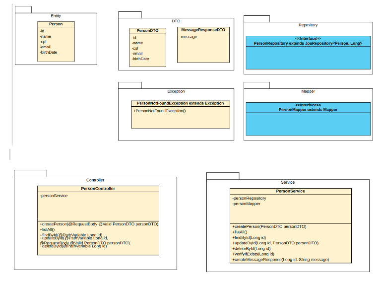

#API REST usando Spring Boot 2, Hibernate, JPA, e H2 com Deploy no Heroku.

##O Problema que Queremos Resolver:

Precisamos implementar uma API REST que precisa suportar o processo de abertura de nova conta no banco. O primeiro passo desse fluxo é cadastrar os dados pessoais de uma
pessoa. Precisamos de apenas algumas informações obrigatórias:

* Nome
* E-mail
* CPF
* Data de nascimento

Caso os dados estejam corretos, é necessário gravar essas informações no banco de dados relacional e retornar o status adequado para a aplicação cliente, que pode ser uma página web ou um aplicativo mobile.
A API devolverá a resposta adequada para o caso de falha de validação.

##Tecnologias a Serem Utilizadas:

As stacks principais serão Java, Spring e Hibernate e desdobrando-as usaremos:

* Java 11;
* Maven 3.6.3;
* Spring Boot (última versão estável);
* GIT/GITHUB para versionamento de código;
* Heroku para deploy na nuvem;
* Intellij (IDE);

##Quais classes serão criadas nesse processo?

Como o problema inicial é realizar o cadastro de pessoas e como estamos usando o paradigma de Orientação a Objetos (OO) com Java, precisamos representar as pessoas cadastradas através de uma classe, e seus atributos serão as propriedades que identificam essa pessoa, assim teremos a classe Person. Essa classe representa a tabela que será gerada no banco de dados. As demais classes e interfaces serão classes que darão suporte ao cadastro de pessoas e permitirão a dinâmica da arquitetura Rest no Spring, bem como a implementação de alguns padrões de desenvolvimento.

##Qual foi o processo de decisão para realizar a implementação?

O primeiro passo é entender o problema e em seguida verificar o que está sendo feito para resolver problemas semelhantes, neste caso, como nosso problema está bem delimitado fica mais fácil encontrar a solução, foi pedido uma API REST para o processo de cadastro, então é necessário entender o que é uma API REST (Representational State Transfer).
Na arquitetura REST, descrita por Roy Fieldman em sua dissertação de doutorado, utilizamos o protocolo HTTP como forma de comunicação, assim clientes diferentes atingem os mesmos End Points, executam ações iguais e recebem as mesmas respostas. Esta é uma arquitetura madura e muito utilizada o que facilita a obtenção de informações. Neste padrão devemos mapear nossas operações necessárias ao cadastro e manipulação dos dados para verbos HTTP, e o framework Spring já é totalmente compatível com esta arquitetura o que facilita todo o processo de desenvolvimento. Desta forma seguiremos as recomendações da comunidade utilizando os recursos que o Spring nos oferece.

Para executar o projeto no terminal, digite o seguinte comando:

mvn spring-boot:run
Após executar o comando acima, basta apenas abrir o seguinte endereço e visualizar a execução do projeto:

http://localhost:8080/api/v1/people

Quero agradecer ao professor [Rodrigo Peleias](https://www.linkedin.com/in/rodrigopeleias/), pois suas aulas na Digital Innovation One servirão de base para essa implementação.

Referências:
DTO: https://pt.stackoverflow.com/questions/31362/o-que-%C3%A9-um-dto
H2: https://www.h2database.com/html/main.html
Hibernate: https://www.caelum.com.br/apostila-java-web/uma-introducao-pratica-ao-jpa-com-hibernate
Ivan Souza, O que é Rest : https://rockcontent.com/br/blog/rest/
IntelliJ: https://www.jetbrains.com/pt-br/idea/
Java SE: https://www.oracle.com/java/technologies/java-se-glance.html
Loiane Groner, CRUD REST using Spring Boot 2, Hibernate, JPA, and MySQL em:
https://www.oracle.com/br/technical-resources/articles/dsl/crud-rest-sb2-hibernate.html
Lombok: https://github.com/rzwitserloot/lombok/wiki
MapStruct: https://mapstruct.org/ e https://medium.com/dev-cave/mapstruct-mapeando-seus-dtos-para-model-8bc362b628fe
Maven: https://pt.stackoverflow.com/questions/59240/para-que-serve-o-maven
Padrão DAO:
https://pt.stackoverflow.com/questions/113840/como-funciona-o-padr%C3%A3o-dao
Postman: https://learning.postman.com/docs/getting-started/introduction/
REST: https://restfulapi.net/
Rodrigo Peleias : Spring Boot - API REST para Cadastro de usuários. ,  https://github.com/rpeleias/personapi_dio_live_coding
Roy Fielding: https://www.ics.uci.edu/~fielding/pubs/dissertation/top.htm
Spring Boot: https://spring.io/projects/spring-boot
Spring Data JPA : https://spring.io/projects/spring-data-jpa 
